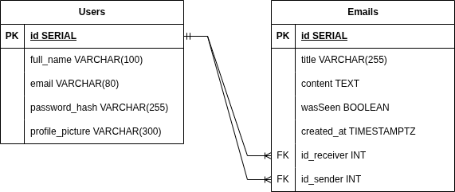

## API de Emails

### Contexto
+ API de emails
+ Contempla concorrência

### Tecnologias usadas
+ Go Language
+ PostgreSQL
+ Gin framework
+ Pacote aws
+ Pacote errors
+ Pacote json
+ Pacote jwt
+ Pacote http
+ Pacote log
+ Pacote pgx/v5 
+ SQLc
+ Tern
+ Docker

### Como rodar o programa
Após criar um arquivo .env, faça:
```bash
docker-compose up -d
go mod tidy
go run ./cmd/tern
go run ./cmd/sqlc
go run ./cmd/api
```
OBS: Requer Docker, Go, SQLc e Tern instalados em seu computador

### Como parar o container Docker e excluir os dados
```bash
docker-compose down -v
```

### Diagrama relacional


